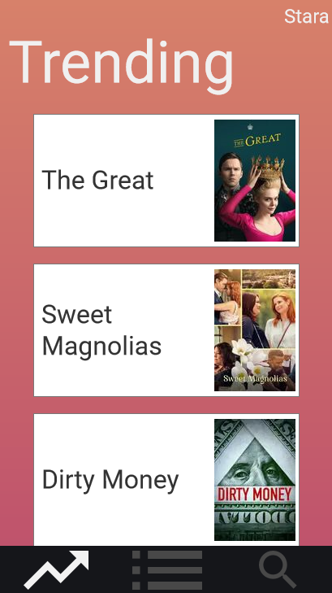
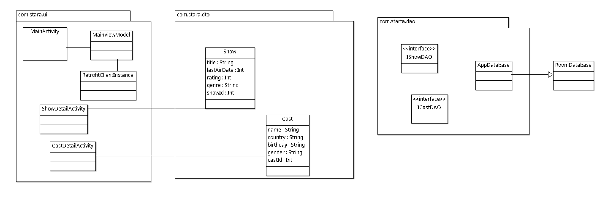

# Stara
---

Design Document  

Umer Muhammad  

Aida Musaeva  

## Introduction  

Have you ever wondered what to watch next?
Due to the popularity of streaming services today, there is just too many options to shift through.  

Stara can help you by:
- Keeping a list of shows you are interested in  
- Making it easy to recommend a show to a friend
- Letting you quickly search for shows based on their title or cast  
- Showing you what shows are currently trending  

Use your Android device to find what to watch next so you don't waste time browsing for something to watch.  

## Storyboard  
[Stara Storyboard](https://3xmhzh.axshare.com/)  
- Storyboard Interaction:  
  - Pages are scrollable
  - Pages can be changed by clicking icons at bottom
  - Search page has a demo to show what happens when user clicks a search result  

## Functional Requirements  

### Requirement 100.0: Search for Shows  
#### Scenario
As a user interested in TV Shows, I want to be able to search for TV Shows based on Title or Cast.  

#### Dependencies
TV Show search data are available and accessible.  

#### Assumptions
TV Show Names are stated in English.  
Cast names are stated in English.  

#### Examples
**1.1**  
**Given** a feed of TV Show data is available  
**When** I search for "Joel" with filter "Cast" applied  
**Then** I should see actors with "Joel" in their name  

**1.2**  
**Given** a feed of TV Show data is available  
**When** I search for "Community" with filter "Show" applied  
**Then** I should see TV Shows with "Community" in their title  

**1.3**  
**Given** a feed of TV Show Data is available  
**When** I search for "BcIT&!KN3oa4bB1DFg"  
**Then** I should see an empty list, indicating no results found  

### Requirement 101.0: Manage List of Shows  
#### Scenario
As a user interested in TV Shows, I want to be able to maint a list of TV shows that I can quickly share or get a notification about.  

#### Dependencies  
TV Show search data are available and accessible  
Database of user's list of shows is available and accessible.  
User has granted access to contacts.  
User has granted access to notifications.  

#### Assumptions
TV Show names are stated in English.  
TV Show users want notifications about is still airing.  

#### Examples
**2.1**  
**Given**  
- A feed of TV Show data is available
- A database of user's list of shows is available  

**When**  
1. Search for TV Show "Community"  
2. Add "Community" to user's list of shows  

**Then** when I navigate to "List" view, I should see "Community" in the list and be able to click on it to see more details.  

**2.2**  
**Given**
- A database of user's list of shows is available  
- User has granted access to contacts  

**When**  
1. I click "Community" within "List" view to see details about "Community"  
2. I see a share button within the details page

**Then** I should see my contacts show where I can quickly share with them the name of the show being viewed.

**2.3**
**Given**  
- A feed of TV Show data is available  
- A database of user's list of shows is available  
- TV show being viewed is still airing  
- User has granted access to notifications  

**When**  
1. I click a show within "List" view  
2. I see a notification button that I click  

**Then** I should be told I will be notified when the next episode of the show being viewed airs.  

### Requirements 102.0: Trending Shows  

#### Scenario  
As a user interested in tv shows, I want to be able to quickly see what shows are trending currently.  

#### Dependencies
TV Show search data are available and accessible. 

#### Assumptions  
TV Show names are stated in English.  

#### Examples  
**3.1**  
**Given** A feed of TV show data is available  
**When** I open the application  
**Then** I should be shown a list of TV shows that are currently trending  

**3.2**  
**Given** A feed of TV show data is *not* available  
**When** I open the application
**Then** I should be told I am *not* connected to the internet and the app's functions are limited.  

## Class Diagram  
  

### Class Diagram Description  

- **MainActivity**: The first screen seen by user. This will be a list of shows that are currently trending.
- **RetrofitClientInstance**: Bootstrap class for Retrofit.
- **ShowDetailActivity**: A screen that displays the details of a TV Show.
- **CastDetailActivity**: A screen that displays the details of a Cast Member.
- **Show**: Noun class that represents a TV Show.
- **Cast**: Noun class that represents a Cast Member.
- **IShowDAO**: Interface for Retrofit to find and parse Show JSON.
- **ICastDAO**: Interface for Retrofit to find and parse Cast JSON.

## Product Backlog  
Located in Github Projects  

## Scrum/Kanban Board  
Located in Github Projects  

## Scrum Roles  
- UI Specialist: Aida Musaeva  
- Integration Specialist: Umer Muhammad  
- DevOps and Product Owner: Umer Muhammad  

## Weekly Stand Up Meeting
Via WhatsApp on Sundays at 8 PM
